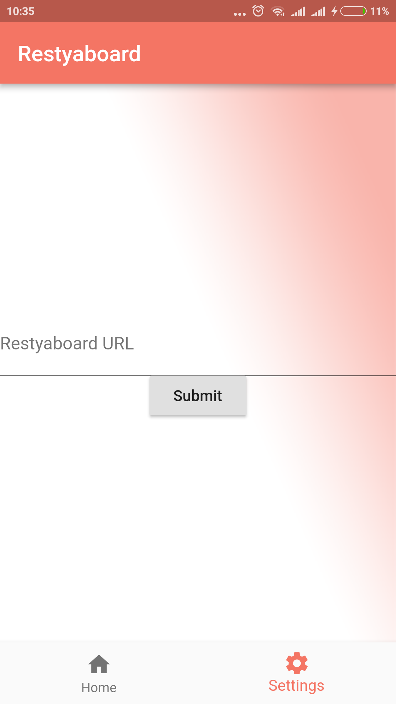
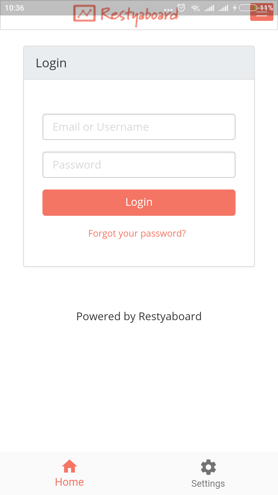
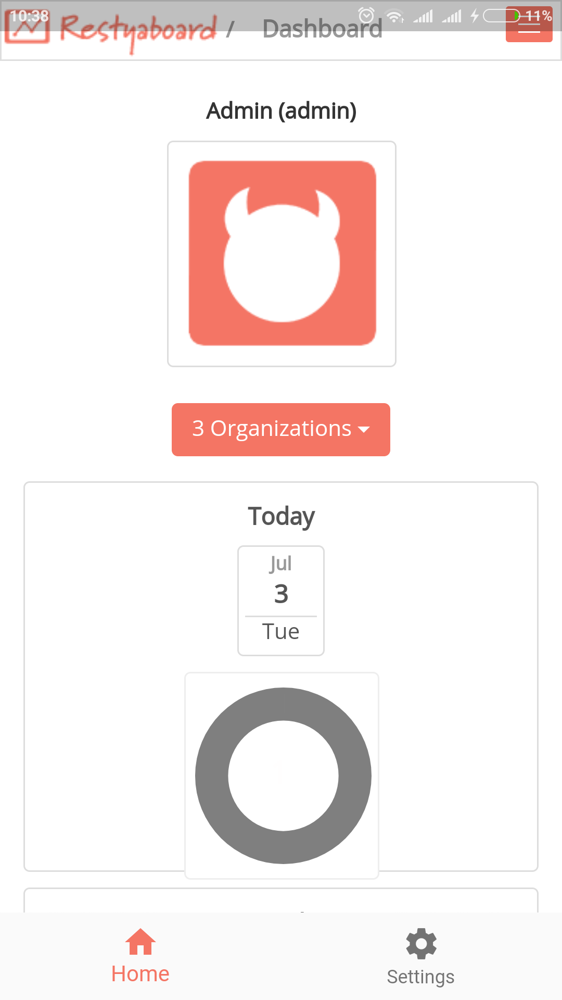

# restyaboard

Restyaboard mobile app.

## Status

### Completed Items

- Getting Restyaboard instance URL from users
- Load user provided Restyaboard instance in web view
- User can change Restyaboard instance URL

### Pending Items

- Add floating action button in web view
- Drag & drop is not user friendly in app

## Screenshots

### Settings

### Login

### Dashboard

## Building From Source

`flutter run`

For help getting started with Flutter, view our online
[documentation](https://flutter.io/).